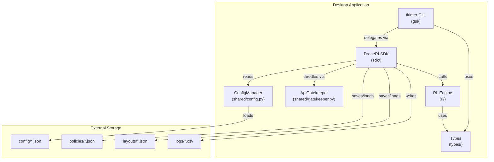
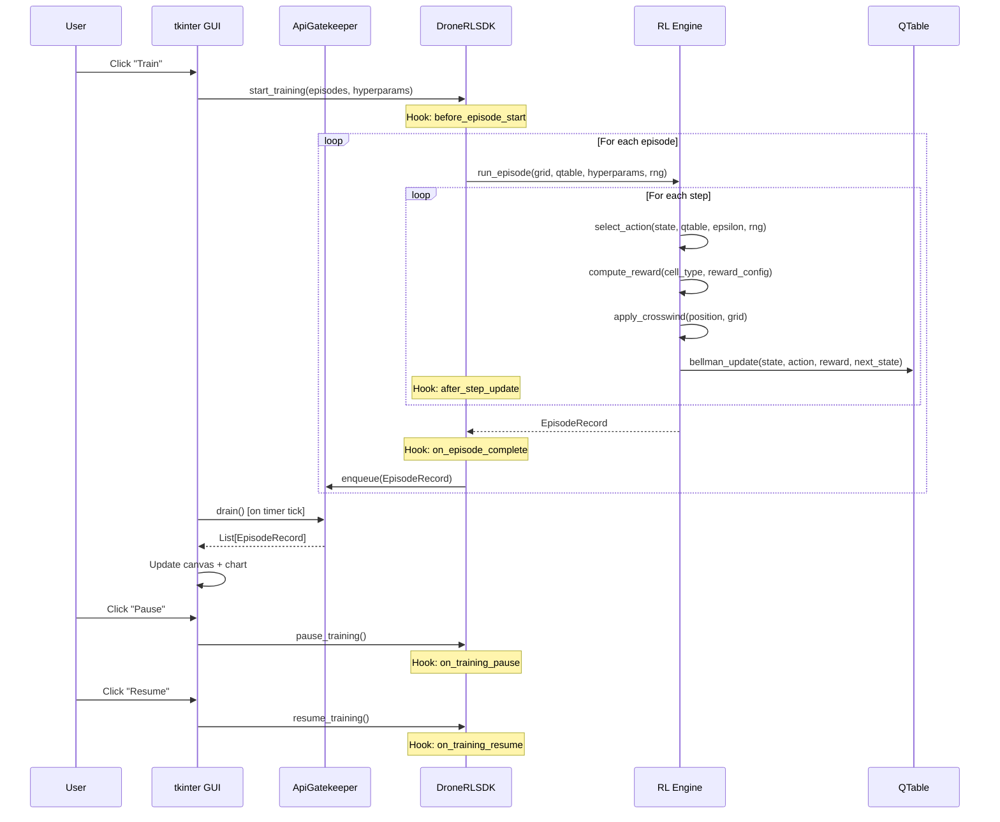

# Architecture — 2D Drone Pathfinding RL Simulation

## C4 Context Diagram

The system follows a three-layer architecture: GUI (presentation), SDK (orchestration), and RL Engine (computation).

```
+-------------------+
|   User (Human)    |
+--------+----------+
         |
         v
+--------+----------+      +---------------------+
|   tkinter GUI     | ---> |   DroneRLSDK        |
|  (Presentation)   |      |  (Orchestration)    |
+-------------------+      +----------+----------+
                                      |
                           +----------+----------+
                           |   RL Engine         |
                           |  (Pure Python)      |
                           +----------+----------+
                                      |
                           +----------+----------+
                           |  config/ JSON Files |
                           +---------------------+
```

The GUI NEVER imports from the RL engine directly. All business logic flows through the SDK.

## C4 Container Diagram



## UML Sequence Diagram — Training Episode Flow



## Thread Safety Model

The training loop runs in a background thread. Communication with the GUI main thread uses:

- `queue.Queue` — thread-safe message passing (EpisodeRecords from trainer to GUI)
- `threading.Lock` — protects shared `SimulationState` reads/writes
- `threading.Event` — pause/stop signaling from GUI to training thread

## Middleware Architecture

Five lifecycle hooks are invoked at defined points during training:

1. `before_episode_start(episode_num)` — before each episode begins
2. `after_step_update(state, action, reward, next_state)` — after each Bellman update
3. `on_episode_complete(record)` — after each episode finishes
4. `on_training_pause()` — when user pauses training
5. `on_training_resume()` — when user resumes training

Middleware functions are registered via `sdk.register_middleware(hook_name, callback)`.

## SDK Boundary Enforcement (§4)

The GUI layer **must never** import directly from `drone_rl.rl`. All RL
operations must go through `DroneRLSDK`. The CI pipeline enforces this with a
grep check that fails the build if any file under `src/drone_rl/gui/` contains
`from drone_rl.rl` or `import drone_rl.rl`.

## No Hardcoded Values Policy (§7)

All domain constants (reward values, hyperparameter defaults, grid sizes) must
live in one of two places only:

- `src/drone_rl/constants.py` — compile-time defaults and cell-colour mappings.
- `config/*.json` — runtime-overridable values loaded by `ConfigManager`.

The only float literal permitted directly inside `src/drone_rl/rl/` source
files is `0.0`, which is the mathematically-defined sentinel for:

- Q-table initialisation: `Q(s,a) = 0` for all s, a.
- Terminal future-Q: when `is_done=True`, the Bellman target uses `γ·0 = 0`.

Any other bare numeric literal found in `rl/` source will fail the CI
`no-hardcoded-values` check defined in `.github/workflows/ci.yml`.

## Configuration Graceful Degradation (§6.3)

`ConfigManager` catches `FileNotFoundError` and `json.JSONDecodeError` on every
config load, logs a `logging.warning`, and falls back to the corresponding
defaults in `constants.py`. The application must never crash due to a missing
or corrupted JSON file.
